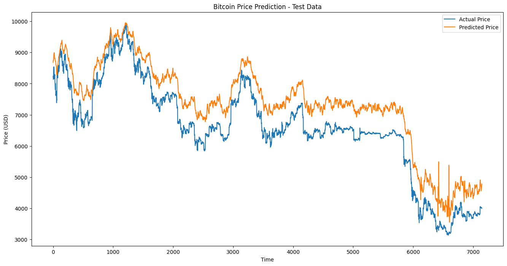

# Forecasting Bitcoin Prices with Time Series Analysis

## Introduction

This project demonstrates the application of time series forecasting techniques to predict Bitcoin (BTC) prices. In the volatile world of cryptocurrency, accurate price forecasting is crucial for investors, traders, and financial analysts. This project leverages advanced machine learning techniques, specifically Bidirectional Gated Recurrent Unit (GRU) networks, to capture and predict the complex patterns in Bitcoin price movements.

Time series forecasting in financial markets, especially for cryptocurrencies like Bitcoin, is valuable for several reasons:

- Investment Decision-Making: Helps investors make informed decisions based on predicted price movements.
- Risk Management: Assists in identifying potential risks and managing portfolios effectively.
- Market Trend Analysis: Provides insights into market trends and potential future scenarios.

## 1. An Introduction to Time Series Forecasting

### What is Time Series Forecasting?

Time series forecasting involves analyzing time-ordered data points to build models that can predict future values based on previously observed values. It takes into account the intrinsic properties of time series data such as trends, seasonality, and cyclic patterns.

### Significance in Financial Markets

In financial markets, time series forecasting is crucial for:

- Predicting Asset Prices and Returns: Anticipating future prices to guide buying and selling strategies.
- Analyzing Market Volatility: Understanding and predicting fluctuations to manage financial risks.
- Identifying Trading Opportunities: Spotting patterns and trends that can be exploited for profit.
- Managing Financial Risks: Implementing strategies to mitigate potential losses based on predicted market movements.

For Bitcoin, accurate forecasting can provide valuable insights into this highly volatile cryptocurrency market, helping stakeholders make informed decisions.

## 2. Preprocessing Method

Our preprocessing pipeline involves several key steps to prepare the Bitcoin price data for modeling:

1. Data Loading: We load data from two sources: Bitstamp and Coinbase.
2. Handling Missing Values: We use forward fill (ffill) to handle missing values, ensuring data continuity.
3. Setting Timestamp as Index: Converts UNIX timestamps to datetime objects and sets them as the DataFrame index.
4. Resampling: We resample the data to hourly intervals to reduce noise and capture meaningful trends.
5. Feature Engineering: We add technical indicators such as Exponential Moving Averages (EMA), Relative Strength Index (RSI), and Moving Average Convergence Divergence (MACD).
6. Normalization: We use MinMaxScaler to scale the data between 0 and 1, which is crucial for neural network training.
7. Sequence Creation: We create sequences of 48 hours to predict the next hour's price.

Here's a code snippet illustrating some of these preprocessing steps:

```python
def preprocess_data(data):
    data['Volume_(BTC)'] = pd.to_numeric(data['Volume_(BTC)'], errors='coerce')
    data = data.ffill()
    data = data.dropna()
    return data

def resample_hourly(data):
    data_hourly = data.resample('H').mean()
    data_hourly = data_hourly.ffill()
    return data_hourly

# Scale the data
scaler = MinMaxScaler(feature_range=(0, 1))
scaled_data = scaler.fit_transform(combined_data[['Average_Close']])
```

These preprocessing steps are crucial for preparing the data for our Bidirectional GRU model, ensuring that it can effectively learn the underlying patterns in the Bitcoin price data.

## 3. Setting Up tf.data.Dataset for Model Inputs

We use TensorFlow's `tf.data.Dataset` API to create an efficient input pipeline for our model. This approach offers several advantages:

1. Memory Efficiency: It allows us to work with large datasets that don't fit into memory.
2. Performance: It provides optimized methods for batching, shuffling, and prefetching data.
3. Ease of Use: It seamlessly integrates with TensorFlow models.

Here's how we set up our dataset:

```python
def create_dataset(X, y, batch_size=32, shuffle_buffer=1000):
    dataset = tf.data.Dataset.from_tensor_slices((X, y))
    dataset = dataset.shuffle(buffer_size=shuffle_buffer)
    dataset = dataset.batch(batch_size)
    dataset = dataset.prefetch(tf.data.AUTOTUNE)
    return dataset

train_dataset = create_dataset(X_train_final, y_train_final)
val_dataset = create_dataset(X_val, y_val, shuffle_buffer=1)
test_dataset = create_dataset(X_test, y_test, shuffle_buffer=1)
```

This approach ensures that our data pipeline is optimized for training deep learning models on time series data.

## 4. Model Architecture

For this project, we use a Bidirectional Gated Recurrent Unit (GRU) network, a type of recurrent neural network well-suited for sequence prediction problems like time series forecasting.

Our model consists of:

- Two Bidirectional GRU layers with 64 units each
- Batch Normalization layers for stabilizing and accelerating training
- Dropout layers for regularization to prevent overfitting
- Dense layers for final prediction

Here's the model architecture:

```python
from tensorflow.keras.layers import Bidirectional, GRU

model = Sequential([
    Bidirectional(
        GRU(
            64,
            return_sequences=True,
            activation='tanh',
            kernel_regularizer=tf.keras.regularizers.l2(0.001)
        )
    ),
    BatchNormalization(),
    Dropout(0.3),
    Bidirectional(
        GRU(
            64,
            activation='tanh',
            kernel_regularizer=tf.keras.regularizers.l2(0.001)
        )
    ),
    BatchNormalization(),
    Dropout(0.3),
    Dense(32, activation='relu'),
    Dense(1)
])

model.compile(optimizer=Adam(learning_rate=0.001), loss='mse', metrics=['mae'])
```

We chose Bidirectional GRU for its ability to capture temporal dependencies, efficiency, and effectiveness in handling the vanishing gradient problem.

## 5. Results and Evaluation

After training our model for 17 epochs, we evaluated its performance using several metrics:

```
Training MSE: 0.0007, MAE: 0.0171
Validation MSE: 0.0053, MAE: 0.0498
Test MSE: 0.0019, MAE: 0.0380

Training Data Metrics:
MSE: 156917.36
RMSE: 396.13
MAE: 335.45
R2 Score: 0.9184

Validation Data Metrics:
MSE: 1903515.93
RMSE: 1379.68
MAE: 974.32
R2 Score: 0.7911

Test Data Metrics:
MSE: 599321.02
RMSE: 774.16
MAE: 743.07
R2 Score: 0.7428
```

### Analysis and Insights

1. Strong Predictive Performance: The high R² scores across training, validation, and test datasets indicate that the model effectively captures the variance in Bitcoin prices.
2. Generalization Capability: The model maintains robust performance on unseen test data, demonstrating its ability to generalize beyond the training set.
3. Error Distribution: The residuals are mostly small, indicating that the model's predictions are close to the actual prices.

### Visualization of Results



The graph above shows the model's predictions against actual Bitcoin prices, demonstrating its ability to capture the overall trend and patterns in price movements.

## 6. Conclusion

Our Bidirectional GRU model demonstrates strong learning capabilities and effective generalization to unseen data. The comprehensive preprocessing pipeline and feature engineering steps contribute significantly to the model's performance.

### Key Takeaways:

- The model successfully captures complex patterns in Bitcoin price movements.
- High R² scores on validation and test datasets indicate good generalization.
- Proper data preprocessing and feature engineering are crucial for building effective time series forecasting models.

### Future Work:

- Incorporate additional features like macroeconomic indicators or sentiment analysis.
- Experiment with alternative architectures like Transformer-based models.
- Implement time-series-specific cross-validation techniques.
- Adapt the model for real-time forecasting applications.

This project highlights the potential of advanced machine learning techniques in cryptocurrency price forecasting, providing valuable insights for investors and traders in the volatile Bitcoin market.

The complete code for this project can be found in [this GitHub repository](https://github.com/thedavidemmanuel/BTC-Time-Series-Forecasting).
