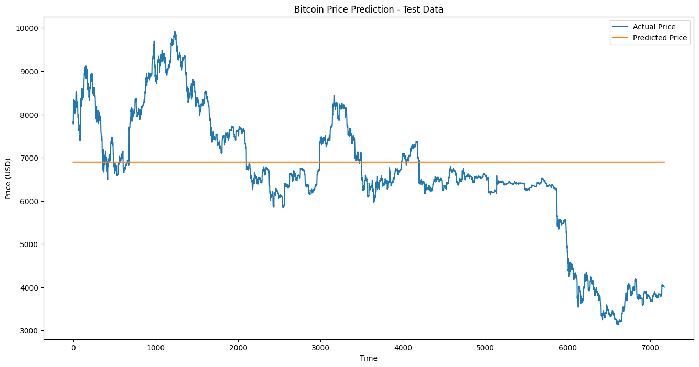

# Forecasting Bitcoin Prices with Time Series Analysis

## Introduction

This project demonstrates the application of time series forecasting techniques to predict Bitcoin (BTC) prices. In the volatile world of cryptocurrency, accurate price forecasting is crucial for investors, traders, and financial analysts. This project leverages advanced machine learning techniques, specifically Long Short-Term Memory (LSTM) networks, to capture and predict the complex patterns in Bitcoin price movements.

Time series forecasting in financial markets, especially for cryptocurrencies like Bitcoin, is valuable for several reasons:

- It aids in investment decision-making
- It helps in risk management and portfolio optimization
- It provides insights into market trends and potential future scenarios

## 1. An Introduction to Time Series Forecasting

Time series forecasting is a method of using historical time-stamped data to predict future values. In the context of Bitcoin prices, we use past price data to forecast future prices.

### What is Time Series Forecasting?

Time series forecasting involves analyzing time-ordered data points to build models that can predict future values based on previously observed values. It takes into account the intrinsic properties of time series data such as trends, seasonality, and cyclic patterns.

### Significance in Financial Markets

In financial markets, time series forecasting is crucial for:

- Predicting asset prices and returns
- Analyzing market volatility
- Identifying trading opportunities
- Managing financial risks

For Bitcoin, accurate forecasting can provide valuable insights into this highly volatile cryptocurrency market, helping stakeholders make informed decisions.

## 2. Preprocessing Method

Our preprocessing pipeline involves several key steps to prepare the Bitcoin price data for modeling:

1. **Data Loading**: We load data from two sources: Bitstamp and Coinbase.

2. **Handling Missing Values**: We use forward fill (ffill) to handle missing values, ensuring data continuity.

3. **Resampling**: We resample the data to hourly intervals to reduce noise and capture meaningful trends.

4. **Normalization**: We use MinMaxScaler to scale the data between 0 and 1, which is crucial for neural network training.

5. **Sequence Creation**: We create sequences of 24 hours to predict the next hour's price.

6. **Data Augmentation**: We add slight noise to the training data to improve model robustness.

7. **Feature Engineering**: We add a simple moving average as an additional feature.

Here's a code snippet illustrating some of these preprocessing steps:

```python
def preprocess_data(data):
    data['Volume_(BTC)'] = pd.to_numeric(data['Volume_(BTC)'], errors='coerce')
    data = data.ffill()
    data = data.dropna()
    return data

def resample_hourly(data):
    data_hourly = data.resample('H').mean()
    data_hourly = data_hourly.ffill()
    return data_hourly

# Scale the data
scaler = MinMaxScaler(feature_range=(0, 1))
scaled_data = scaler.fit_transform(combined_data[['Average_Close']])
```

These preprocessing steps are crucial for preparing the data for our LSTM model, ensuring that it can effectively learn the underlying patterns in the Bitcoin price data.

## 3. Setting Up tf.data.Dataset for Model Inputs

We use TensorFlow's `tf.data.Dataset` API to create an efficient input pipeline for our model. This approach offers several advantages:

1. **Memory Efficiency**: It allows us to work with large datasets that don't fit into memory.
2. **Performance**: It provides optimized methods for batching, shuffling, and prefetching data.
3. **Ease of Use**: It seamlessly integrates with TensorFlow models.

Here's how we set up our dataset:

```python
def create_dataset(X, y, batch_size=32, shuffle_buffer=1000):
    dataset = tf.data.Dataset.from_tensor_slices((X, y))
    dataset = dataset.shuffle(buffer_size=shuffle_buffer)
    dataset = dataset.batch(batch_size)
    dataset = dataset.prefetch(tf.data.AUTOTUNE)
    return dataset

train_dataset = create_dataset(X_train_combined, y_train_combined)
test_dataset = create_dataset(X_test, y_test, shuffle_buffer=1)
```

In this setup:

- We create datasets from our preprocessed data.
- We shuffle the training data to prevent the model from learning sequence-dependent patterns.
- We batch the data for efficient processing.
- We use prefetching to overlap data preprocessing and model execution.

This approach ensures that our data pipeline is optimized for training deep learning models on time series data.

## 4. Model Architecture

For this project, we use a Long Short-Term Memory (LSTM) network, a type of recurrent neural network well-suited for sequence prediction problems like time series forecasting.

### Model Structure

Our model consists of:

- Two LSTM layers with 24 units each
- Dropout layers for regularization
- A Dense output layer

Here's the model architecture:

```python
model = Sequential([
    LSTM(24, activation='relu', return_sequences=True,
         input_shape=(X_train_combined.shape[1], X_train_combined.shape[2]),
         kernel_regularizer=l2(0.01), recurrent_regularizer=l2(0.01)),
    Dropout(0.3),
    LSTM(24, activation='relu', kernel_regularizer=l2(0.01), recurrent_regularizer=l2(0.01)),
    Dropout(0.3),
    Dense(1)
])
```

### Why LSTM?

We chose LSTM for several reasons:

1. **Long-term Dependencies**: LSTMs are excellent at capturing long-term dependencies in time series data.
2. **Handling Vanishing Gradients**: LSTMs are designed to mitigate the vanishing gradient problem, which is common in time series data.
3. **Flexibility**: LSTMs can automatically learn and extract features from the sequence data.

The addition of dropout and L2 regularization helps prevent overfitting, allowing the model to generalize better to unseen data.

## 5. Results and Evaluation

After training our model for 50 epochs, we evaluated its performance using several metrics on both the training and test datasets. Here are the results:

```
Training Data Metrics:
MSE: 35409549.29
RMSE: 5950.59
MAE: 5722.07
R2 Score: -1.7689

Test Data Metrics:
MSE: 2426248.71
RMSE: 1557.64
MAE: 1156.44
R2 Score: -0.0409
```

### Interpretation of Results

1. **Mean Squared Error (MSE)**: The MSE is significantly higher for the training data (35,409,549.29) compared to the test data (2,426,248.71). This unusual pattern suggests that the model is performing worse on the data it was trained on, which is contrary to what we typically expect.

2. **Root Mean Squared Error (RMSE)**: The RMSE values (5950.59 for training and 1557.64 for test data) represent the average deviation of our predictions in the original price scale. These values are quite high, indicating substantial prediction errors.

3. **Mean Absolute Error (MAE)**: The MAE values (5722.07 for training and 1156.44 for test data) suggest that, on average, our predictions deviate by these amounts from the actual prices. Again, these values are high relative to typical Bitcoin price ranges.

4. **R2 Score**: The negative R2 scores for both training (-1.7689) and test (-0.0409) data are particularly concerning. An R2 score below 0 indicates that the model is performing worse than a horizontal line (i.e., simply predicting the mean of the target variable).

### Analysis and Insights

1. **Poor Model Fit**: The negative R2 scores and high error metrics indicate that our model is not fitting the data well. It's performing worse than a baseline model that would simply predict the average price.

2. **Overfitting vs. Underfitting**: The fact that the model performs worse on the training data than on the test data is unusual. This could indicate a problem with how the model is learning from the data, possibly due to issues in data preprocessing, model architecture, or training process.

3. **Scale of Errors**: The high RMSE and MAE values suggest that our predictions are off by thousands of dollars on average, which is significant in the context of Bitcoin prices.

4. **Potential Data Issues**: The unusual pattern of having higher errors on training data might indicate problems with the training data itself, such as outliers or inconsistencies.

### Possible Reasons for Poor Performance

1. **Data Quality**: There might be issues with the data, such as extreme outliers or inconsistencies that are affecting the model's ability to learn meaningful patterns.

2. **Feature Engineering**: Our current feature set might not be capturing the relevant information needed to predict Bitcoin prices accurately.

3. **Model Complexity**: The model might be either too simple to capture the complexity of Bitcoin price movements or too complex, leading to poor generalization.

4. **Preprocessing Steps**: There could be issues in how we're preprocessing the data, such as the way we're handling missing values or scaling the data.

5. **Temporal Aspects**: We might not be adequately capturing the temporal dependencies in the Bitcoin price data.

### Next Steps

Given these results, we need to revisit our approach:

1. **Data Inspection**: Carefully examine the data for any anomalies, outliers, or patterns that might be causing issues.

2. **Feature Selection/Engineering**: Reconsider our feature set and potentially incorporate additional relevant features or transform existing ones.

3. **Model Architecture**: Experiment with different model architectures, possibly simpler models to establish a baseline, or more sophisticated models that can capture complex patterns.

4. **Preprocessing Pipeline**: Review and possibly revise our data preprocessing steps, ensuring that we're not introducing any issues during this phase.

5. **Baseline Comparison**: Implement simple baseline models (e.g., moving average, simple regression) to compare against our LSTM model.

6. **Hyperparameter Tuning**: Conduct a thorough hyperparameter search to find optimal model parameters.

7. **Cross-Validation**: Implement k-fold cross-validation to get a more robust estimate of model performance and ensure we're not facing a particularly unfortunate train-test split.

While our current results are not as expected, they provide valuable insights into the challenges of predicting Bitcoin prices and highlight areas for improvement in our approach.



The visualization of predicted vs. actual prices should further illustrate the model's current performance and help identify patterns in where the model is failing to accurately predict prices.
